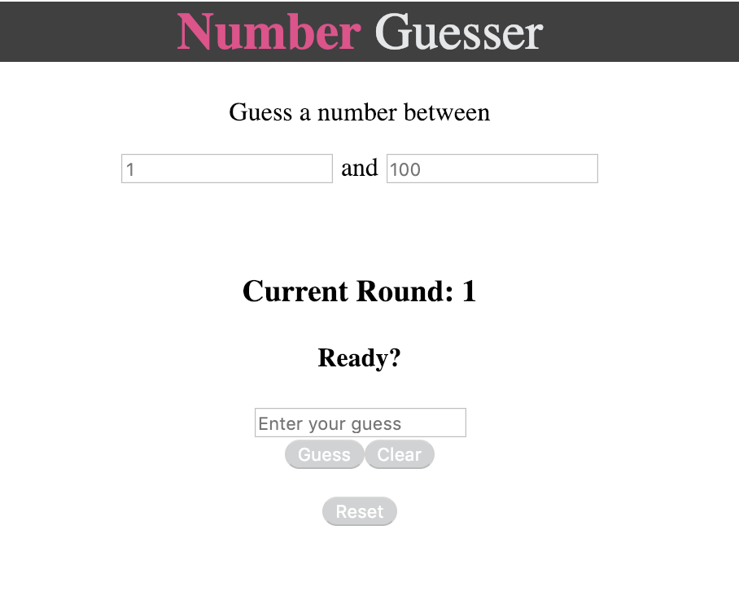
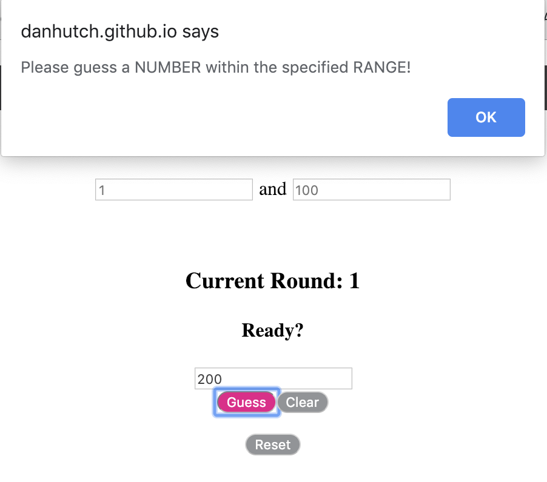
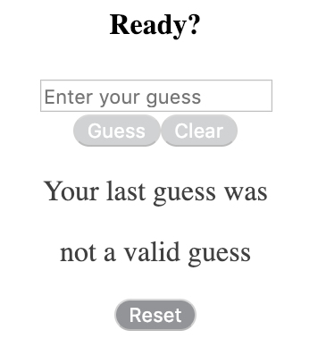
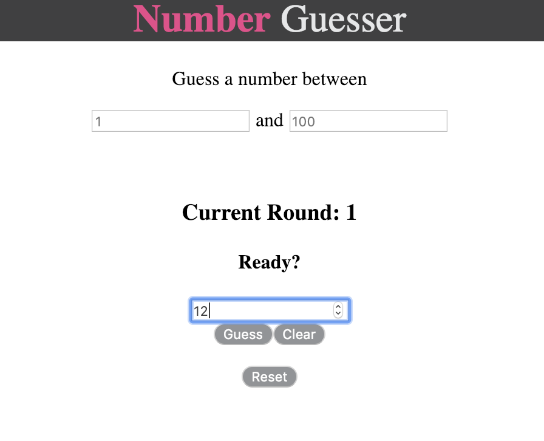
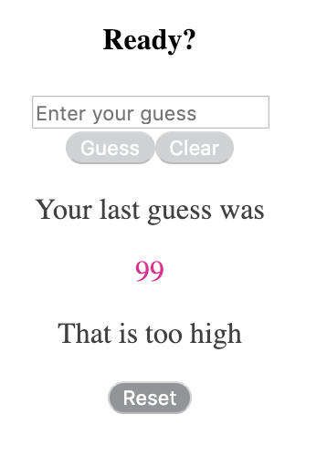
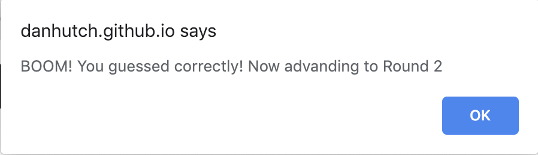
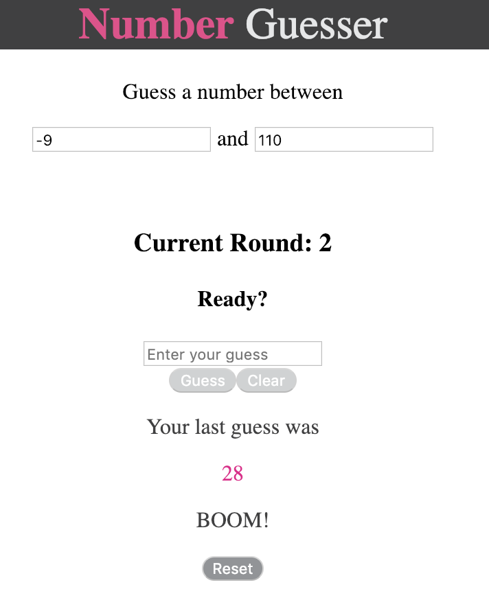
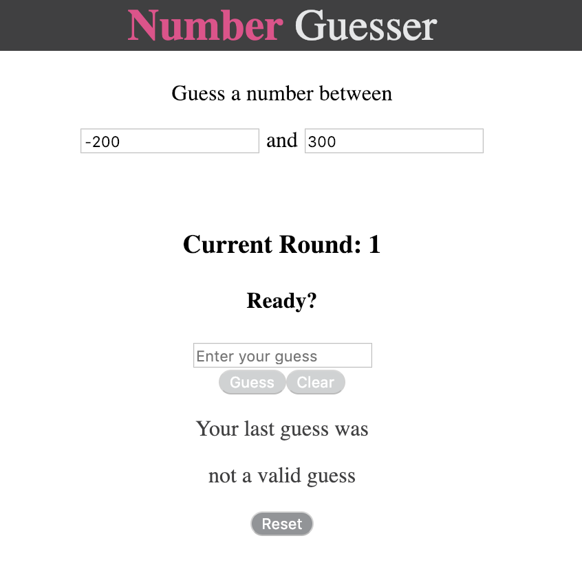

# README
## Number Guesser

Number Guesser is a front-end-only app built with NodeJS v10.15.0, HTML5, and CSS. Number Guesser generates a random number within a specified, user-editable range and accepts numerical user guesses. When a user guesses correctly, it expands the minimum of the accepted range by -10 and the maximum by 10. Number Guesser can be found, and played, at https://danhutch.github.io/number_guesser/.




## User Interactions

##### Guess Submission and Feedback

The user may, at any time, enter a numerical guess in the "Enter your guess" input field. This field will only accept numerical submissions, and will alert the user if a guess is entered that is not within the specified range:



After this alert has been dismissed, the previous guess feedback section will display that the previuous guess was not a valid one:




The "Guess" and "Clear" buttons are disabled until or unless a guess is entered.



When a user submits a guess that is higher than the master number (which the user is trying to guess), the previous guess feedback section of the page will display the value of the previous guess, along with feedback that this guess was too high.



Similarly, if a guess is too low, that section will display the guess along with a hint that the guess was too low.

If a user guesses correctly, they will see an alert that BOOM! They have guessed correctly. This alert will also indicated that the game is moving on to the next round:



After this alert is dismissed, the page will declare the new current round, below the newly expanded range for the new Round (more on this in the next section):




##### Range

The user may also edit the acceptable range. Doing so will automatically generate a new master number (the number that the user is trying to guess).



##### Rounds

Each time a user guesses correctly, the Round number will increment up by 1. When this occurs, the specified range will also be expanded by 20 (-10 for the range-minimum and 10 for the range-maximum).

##### Resetting

At any time, if there is anything to reset (if the Round is greater than 1 and the range has been edited and/or a guess has been entered or submitted), a user may click the "Reset" button to return the game to its default state. This will cause the Round to return to 1 and the range to return to the default range of 1 to 100, as well as for all input fields to be cleared and guess history erased.


### Setup:

To begin, simply clone this repo:

```
https://github.com/DanHutch/number_guesser
```

### Contributing:

In order to contribute, please fork this repo, then clone your new repo and create a branch for your feature.

Please make sure to test your feature fully before commiting your changes and pushing to your own repo, then create and submit a pull request back to this repository.

Please contact Dan Hutchinson on Github if you have any questions, etc. Thank you!

